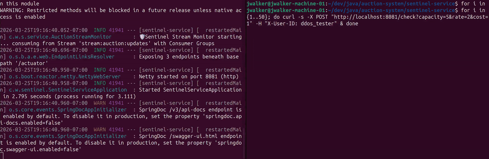
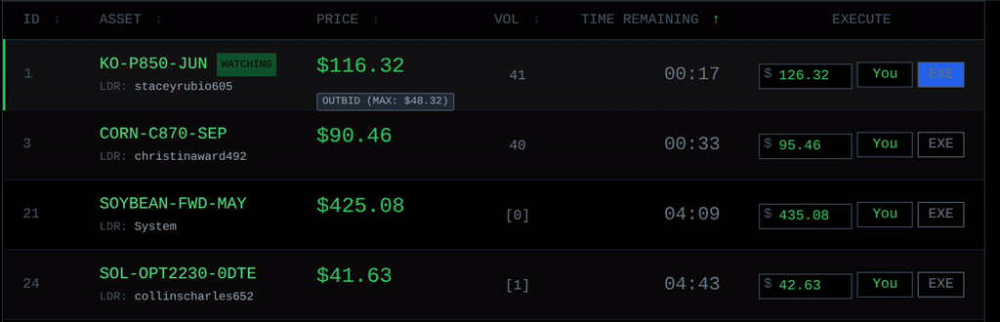
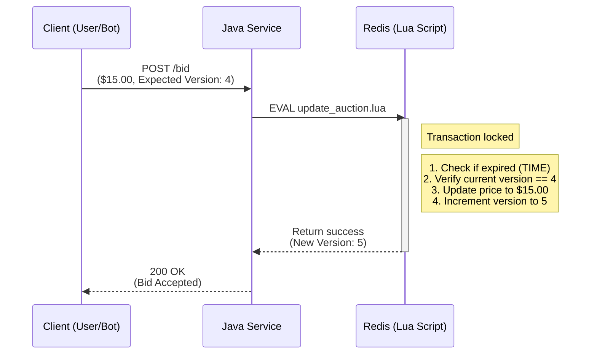
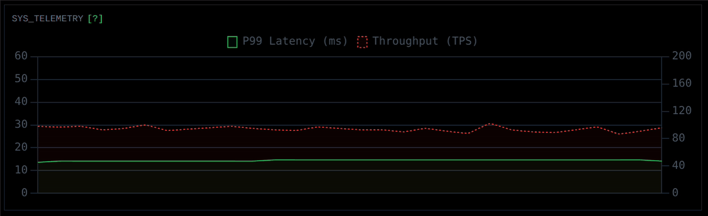

<div align="center">
  <a href="https://bidstream.dev/" target="_blank">
    
  </a>
</div>

Bidstream is a reactive, high-frequency trading platform designed to handle massive traffic spikes, mitigate race conditions via atomic state management, display continuously updating visuals representing real-time data, and run live machine learning fraud detection without degrading performance.

<div align="center">
  
  <p><em>Live dashboard processing bot swarm traffic while maintaining stable P99 latency.</em></p>
</div>

<div align="center">
  <a href="https://www.loom.com/share/0cd99f26a7a44051b5c202e6cfc240a9" target="_blank">
    
  </a>
  <p><em>Click above for a 3-minute technical walkthrough of the architecture and code.</em></p>
</div>

---

## Architecture

The ecosystem relies on an event-driven, decoupled architecture.


## Key Features

### 1. DDoS Mitigation at the Cache Layer

To protect the main Java JVM from wasting CPU cycles on dead or malicious traffic, the perimeter is secured by a custom token bucket rate limiter.

<div align="center">
  
  <p><em>Redis-backed Token Bucket algorithm instantly evades a simulated 50-request DDoS attack.</em></p>
</div>

Every incoming request is evaluated in-memory within Redis. Malicious IPs attempting to flood the application are dropped instantly at the cache layer, maintaining stability for legitimate users.

### 2. Atomic Transactions and Race Condition Prevention

In a highly concurrent system, two users bidding at the exact same millisecond can cause a double-spend or time-of-check to time-of-use vulnerability.

To solve this, the Java server does not evaluate the math. Instead, it delegates the bid to an atomic Redis Lua script. This guarantees strict consistency and optimistic locking.

<div align="center">
  
  <p><em>An atomic Lua script safely resolves simultaneous bids, preventing race conditions and double-spends.</em></p>
</div>



### 3. Non-Blocking I/O and Real-Time Data Streaming

Built entirely on Spring WebFlux, the application uses a small pool of non-blocking event loop threads. When Redis commits a state change, it publishes a notification that Java pushes directly to the browser via Server-Sent Events.

<div align="center">
  
  <p><em>Server-Sent Events stream hundreds of logs per second without choking the browser's render thread.</em></p>
</div>

To prevent the browser's rendering engine from choking on hundreds of log lines per second, the frontend leverages a detached `DocumentFragment` to batch DOM mutations in memory before repainting the screen, keeping the framerate smooth.

<div align="center">
  
  <p><em>Live Throughput (TPS) and P99 Latency metrics reacting instantly to the distributed bot swarm.</em></p>
</div>

The backend utilizes Spring Boot's Micrometer registry to aggregate high-frequency requests into rolling windows. The frontend then processes this time-series data using a lightweight rendering cycle.

### 4. Decoupled AI Fraud Detection

Running heavy machine learning models on the main server thread destroys P99 latency. Therefore, fraud detection is entirely decoupled.

A separate Sentinel microservice collects live bids in micro-batches and sends them to a Python CatBoost model. If a bot is detected, an alert is pushed to a Redis Stream. The Java engine reads the stream, reverts the bad bid to the correct price, and bans the user asynchronously without interrupting the flow of ongoing auctions.

## Links

- [Public Site](https://bidstream.dev)
- [Documentation](https://walker-systems.github.io/auction-system/)
- [Live Grafana Dashboard](https://metrics.bidstream.dev)
- [Source Repository](https://github.com/walker-systems/auction-system)

## Quick Start

The fastest way to run the entire distributed system locally is via Docker Compose.

```bash
# 1. Clone the repository
git clone https://github.com/walker-systems/auction-system.git
cd auction-system

# 2. Start the infrastructure
docker compose up -d

# 3. Access the dashboard
# Open your browser and navigate to: http://localhost:8080
```

## Local Development Setup

If you wish to run the microservices independently for development:

### 1. Start Redis

```bash
docker run -d -p 6379:6379 --name bidstream-redis redis:7.2-alpine
```

### 2. Start the Machine Learning API (Python)

```bash
cd sentinel-ml
python -m venv .venv
source .venv/bin/activate
pip install -r requirements.txt
uvicorn main:app --port 8000
```

### 3. Start the Java Services

```bash
# Terminal 1: Bidding Engine
cd bidding-engine
./mvnw spring-boot:run

# Terminal 2: Sentinel Service
cd sentinel-service
./mvnw spring-boot:run
```

## API Documentation

Interactive API documentation is available upon request.

---

<div align="center">
  <p><strong>Created by <a href="https://walker-systems.github.io/">Justin Walker</a></strong></p>
</div>
