# ⚡ Real-Time Bidding & Fraud Detection Platform
[](https://walker-systems.github.io/auction-system/)

This is a live auction platform that uses AI to catch fraudulent bids in real time. It is built with Spring Boot and Redis to handle fast, continuous data streams, instantly blocking bots without slowing down the user experience.

## 🏗️ How It Works

Here is a high-level look at how data moves through the platform when a bid is placed:

```mermaid
graph LR
    %% Define styles
    classDef user fill:#3b82f6,stroke:#2563eb,stroke-width:2px,color:#fff,font-weight:bold;
    classDef core fill:#10b981,stroke:#059669,stroke-width:2px,color:#fff,font-weight:bold;
    classDef db fill:#ef4444,stroke:#dc2626,stroke-width:2px,color:#fff,font-weight:bold;
    classDef ai fill:#8b5cf6,stroke:#7c3aed,stroke-width:2px,color:#fff,font-weight:bold;
    classDef external fill:#374151,stroke:#1f2937,stroke-width:2px,color:#fff,font-weight:bold;

    %% Nodes
    User((User)):::user
    BE[Bidding Engine]:::core
    Redis[(Redis Pub/Sub)]:::db
    Sentinel[Sentinel Service]:::ai
    LLM[OpenAI]:::external

    %% Flow
    User -->|1. Places Bid| BE
    BE -->|2. Saves & Broadcasts| Redis
    Redis -->|3. Triggers Alert| Sentinel
    Sentinel <-->|4. Checks Context| LLM
    Sentinel -.->|5. Rejects Fraud| Redis
    Redis -.->|6. Live UI Update| BE
    BE -.->|7. Shows Rejection| User
```



### The Core Pieces
* **The Storefront (Bidding Engine):** This is the user interface. It takes incoming bids and uses active streams to update the screen instantly for everyone watching, without them needing to refresh the page.
* **The Broker (Redis):** This acts as the central nervous system. Instead of the storefront talking directly to the security service, they both just talk to Redis. This keeps the storefront moving fast.
* **The Security Guard (Sentinel):** This service silently watches every bid that drops into Redis. It packages the bid's context and asks the AI if the behavior looks like a bot. If it catches fraud, it sends a kill signal back through Redis to reverse the bid on everyone's screen.

---

## 🚀 Quick Start Guide

Follow these steps to run the platform locally on your machine.

### Prerequisites
* **Docker** (must be running in the background)
* **Java 21+**
* **OpenAI API Key** (needed for the Sentinel to analyze bids)

### 1. Get the Code
```bash
git clone [https://github.com/walker-systems/auction-system.git](https://github.com/walker-systems/auction-system.git)
cd auction-system
```

### 2. Start the Database
```bash
docker compose up -d
```

### 3. Start the Bidding Engine
Open a terminal in the root folder and run:
```bash
cd bidding-engine
./mvnw spring-boot:run
```

### 4. Start the AI Sentinel
Open a **new terminal window**, set your API key, and run the service:
```bash
cd auction-system/sentinel-service
export SPRING_AI_OPENAI_API_KEY='sk-your-actual-key-here'
./mvnw spring-boot:run
```

### 5. Open the Storefront
Go to **`http://localhost:8080`** in your browser.
* Click **"Start Chaos"** to unleash the demo bots.
* Watch the AI intercept and reverse fake bids in real time.

---

## 🛑 How to Stop It

When you are done testing, you can easily clean up your environment:

1. **Stop the Apps:** Press `Ctrl + C` in both terminal windows (or simply close the tabs).
2. **Stop the Database:** Run this command in the root folder to shut down Redis safely:
   ```bash
   docker compose down
   ```

---

## 🛠️ Troubleshooting

* **Port 8080 or 8081 is in use:** If the apps fail to start, another background process might be using their ports. Find and kill the process:
  ```bash
  lsof -i :8080
  kill -9 <PID>
  ```
* **Maven Wrapper (`./mvnw`) fails:** If hidden `.mvn` folders were lost during the download, regenerate the wrapper using your system's global Maven installation:
  ```bash
  mvn wrapper:wrapper
  ```
* **App crashes immediately:** Make sure you exported the `SPRING_AI_OPENAI_API_KEY` in the exact same terminal window where you are running the Sentinel service.

---

## 📬 Let's Connect

**Justin Walker**

* 🌐 **Portfolio:** [justin-castillo.github.io](https://justin-castillo.github.io/)
* 💼 **LinkedIn:** [Justin Walker](https://www.linkedin.com/in/justin-walker-0403923b1/)
* 📧 **Email:** [justinwalker.contact@gmail.com](mailto:justinwalker.contact@gmail.com)
 ---
