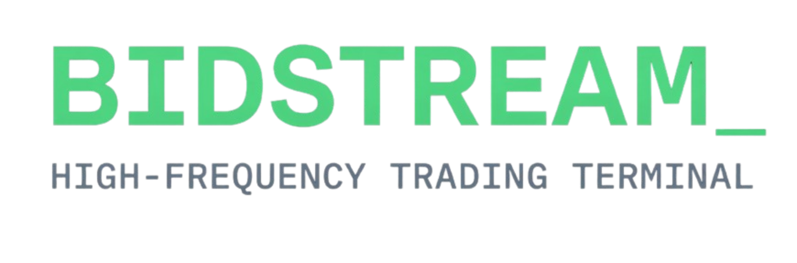
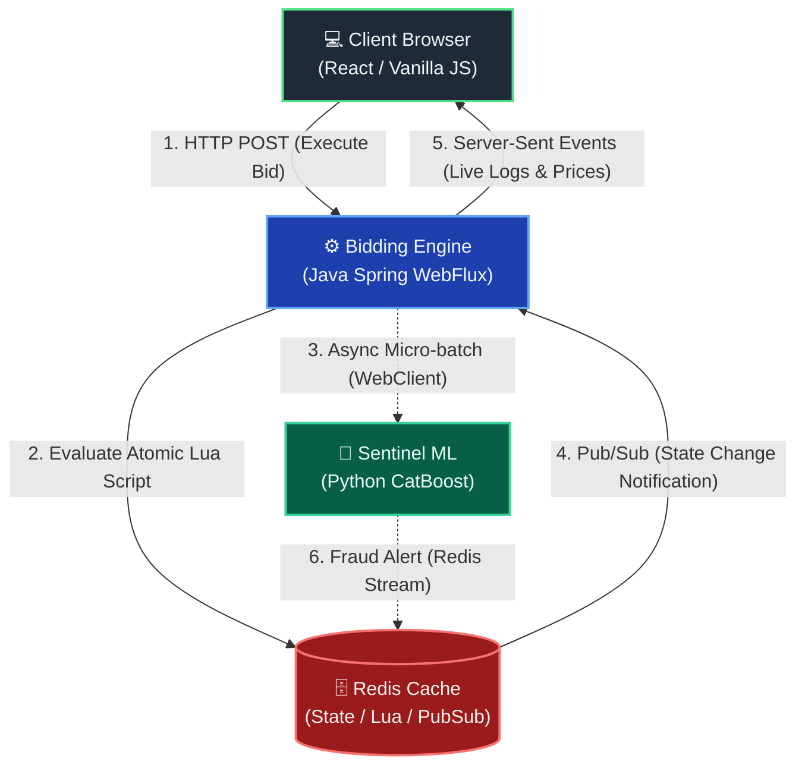
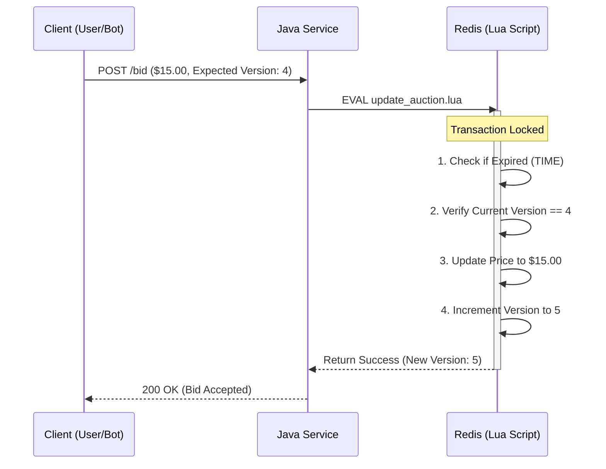

<div align="center">
  
</div>

<div align="center">
  <video src="https://github.com/user-attachments/assets/b930b80a-cd4e-44ce-81ee-624e6e25ecac" autoplay loop muted playsinline width="100%"></video>
</div>

Bidstream is a reactive, high-frequency trading platform designed to solve distributed systems challenges. It demonstrates how to handle massive traffic spikes, mitigate race conditions via atomic state management, display continuously updating visuals representing real-time data, and run live machine learning fraud detection without degrading performance.

<br>

<div align="center">
  <a href="https://www.loom.com/share/0cd99f26a7a44051b5c202e6cfc240a9" target="_blank">
    
  </a>
  <br>
  <p><em>(Click above for a 3-minute technical walkthrough of the architecture and code.)</em></p>
</div>
---

## Architecture

The ecosystem relies on an event-driven, decoupled architecture.



## Key Features

### 1. DDoS Mitigation at the Cache Layer

To protect the main Java JVM from wasting CPU cycles on dead or malicious traffic, 
the perimeter is secured by a custom token bucket rate limiter.

<div align="center">
<video src="https://github.com/user-attachments/assets/f1f9540f-0e82-4e1e-908d-c241c55558a0" autoplay loop muted playsinline width="100%"></video>
</div>

Every incoming request is evaluated in-memory within Redis. 
Malicious IPs attempting to flood the application are dropped instantly at the cache layer, 
maintaining stability for legitimate users.

### 2. Atomic Transactions and Race Condition Prevention

In a highly concurrent system, two users bidding at the exact same millisecond can cause a double-spend or 
"time of check to time of use" (TOCTOU) vulnerability.

<div align="center">
<video src="https://github.com/user-attachments/assets/c22dddcb-6f55-4858-98eb-8c9eb5ab3251" autoplay loop muted playsinline width="100%"></video>
</div>

To solve this, the Java server does not evaluate the math. 
Instead, it delegates the bid to an atomic Redis Lua script. This guarantees strict consistency and optimistic locking.



### 3. Non-Blocking I/O and Real-Time Data Streaming

Built entirely on Spring WebFlux, the application uses a small pool of non-blocking event loop threads. 
When Redis commits a state change, it publishes a notification that Java pushes directly to the browser via 
Server-Sent Events (SSE).

<div align="center">
<video src="https://github.com/user-attachments/assets/15cccc5f-2ad8-4194-bf57-8f5a0f120d76" autoplay loop muted playsinline width="100%"></video>
</div>

To prevent the browser's rendering engine from choking on hundreds of log lines per second, the frontend leverages a detached `DocumentFragment` to batch DOM mutations in memory before repainting the screen, keeping the framerate smooth.

### 4. Decoupled AI Fraud Detection

Running heavy machine learning models on the main server thread destroys P99 latency. 
Therefore, fraud detection is entirely decoupled.

A separate Sentinel microservice collects live bids in micro-batches and sends them to a Python CatBoost model. 
If a bot is detected, an alert is pushed to a Redis Stream. 
The Java engine reads the stream, reverts the bad bid to the correct price, 
and bans the user asynchronously without interrupting the flow of ongoing auctions.

## Quick Start

The fastest way to run the entire distributed system locally is via Docker Compose.

```bash
# 1. Clone the repository
git clone https://github.com/walker-systems/auction-system.git
cd auction-system

# 2. Start the infrastructure
docker compose up -d

# 3. Access the dashboard
# Open your browser and navigate to: http://localhost:8080
```

## Local Development Setup

If you wish to run the microservices independently for development:

### 1. Start Redis

```bash
docker run -d -p 6379:6379 --name bidstream-redis redis:7.2-alpine
```

### 2. Start the Machine Learning API (Python)

```bash
cd sentinel-ml
python -m venv .venv
source .venv/bin/activate
pip install -r requirements.txt
uvicorn main:app --port 8000
```

### 3. Start the Java Services

```bash
# Terminal 1: Bidding Engine
cd bidding-engine
./mvnw spring-boot:run

# Terminal 2: Sentinel Service
cd sentinel-service
./mvnw spring-boot:run
```

## Documentation

The backend services auto-generate OpenAPI (Swagger) documentation. Once the application is running, you can explore the endpoints and schema definitions interactively:

- [Bidding Engine API](http://localhost:8080/swagger-ui.html)
- [Sentinel Service API](http://localhost:8081/swagger-ui.html)
- [Sentinel ML API](http://localhost:8000/docs)

<div align="center">
<p><strong>Created by <a href="https://walker-systems.github.io/">Justin Walker</a></strong></p>

  
  
  
  
  
</div>
