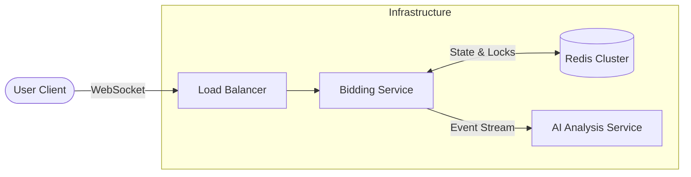

# Bidding Engine System Design

## High-Level Architecture

## 2. Core Components
* **AuctionController:** Handles HTTP `POST /bid` and WebSocket subscriptions.
* **BiddingService:** Contains the business logic and CAS (Compare-And-Swap) loops.
* **AuctionRepository:** Reactive interface for Redis JSON operations.

## 3. Data Flow (Place Bid)
1.  **Ingest:** Request received with `auctionId` and `amount`.
2.  **Fetch:** Service retrieves current `Auction` state from Redis.
3.  **Validate:** Checks `now < endsAt` and `amount > currentPrice`.
4.  **CAS Loop:**
    * Optimistically attempts to update the record.
    * If Redis version mismatch (another bid came in), throw `OptimisticLockingFailureException`.
5.  **Publish:** On success, push `BID_PLACED` event to `stream:auction-events`.
