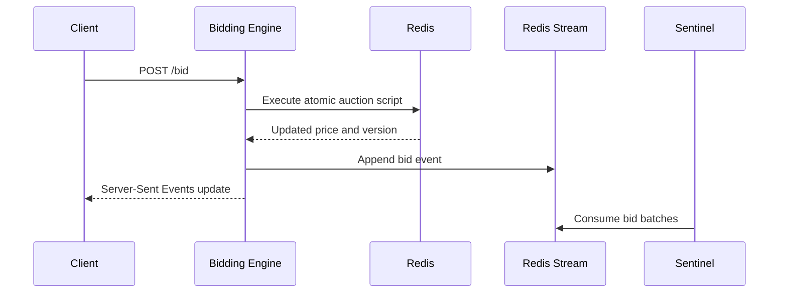

---
hide:
  - navigation
  - path
---

<style>
  .md-content__inner > h1:first-of-type {
    display: none;
  }
</style>

<div align="center">
  <p style="letter-spacing: 0.08em; text-transform: uppercase; color: #9ca3af; margin-bottom: 0.35rem;">
    Component
  </p>
  <h1 style="margin-top: 0;">Bidding Engine</h1>
  <p style="max-width: 760px; margin: 0 auto 1.25rem auto; color: #b6bdc8;">
    Reactive auction execution service responsible for bid intake, final state changes, stream publication, and live client updates.
  </p>
</div>

---

## Purpose

The Bidding Engine is the primary execution path for incoming bids. It accepts HTTP requests, delegates state updates to Redis, and streams the resulting changes back to connected clients. The service is built on Spring WebFlux so network I/O remains non-blocking during traffic spikes.

## Responsibilities

- Accept bid requests from clients
- Execute atomic auction updates through Redis
- Publish bid events to Redis Streams for downstream consumers
- Push live price and log updates through Server-Sent Events
- React to asynchronous fraud decisions without stalling the request path

## Bid Execution Flow



Each bid follows one write path. Redis performs the committed state transition. The Java service owns request handling, validation, event publication, and delivery to the client.

## Design Notes

### Reactive Request Handling

The service runs on Spring WebFlux and uses a small set of non-blocking event loop threads. That keeps request handling predictable even when many clients are connected at once.

### Atomic Auction Updates

Auction state is updated inside Redis rather than across multiple application-side reads and writes. This removes timing windows around simultaneous bids and keeps the current price, version, and auction outcome consistent.

### Event Publication

After a successful update, the engine writes a bid event to a Redis Stream. That keeps downstream processing loosely coupled and allows fraud analysis to run independently of the request-response cycle.

### Live Delivery

Committed state changes are pushed to the browser through Server-Sent Events. This provides a simple one-way channel for prices, logs, and auction status changes.

### Built-In Load Generation

The engine includes a reactive demo bot service for demonstration purposes.

## Runtime Stack

| Layer | Technology |
| --- | --- |
| Language | Java 25 |
| Framework | Spring Boot 4 / WebFlux |
| State Store | Redis |
| Event Backbone | Redis Streams |
| Streaming | Server-Sent Events |
| Testing | JUnit 5 / Testcontainers |

## Quick Start

```bash
docker compose up -d
./mvnw spring-boot:run
```

## Local Development

### Start Redis

```bash
docker run -d -p 6379:6379 --name bidstream-redis redis:7.2-alpine
```

### Run the service

```bash
./mvnw spring-boot:run
```

## API Documentation

When the service is running locally, the OpenAPI documentation is available at:

```text
http://localhost:8080/swagger-ui.html
```

---

<p><strong>Created by <a href="https://walker-systems.github.io/">Justin Walker</a></strong></p>
