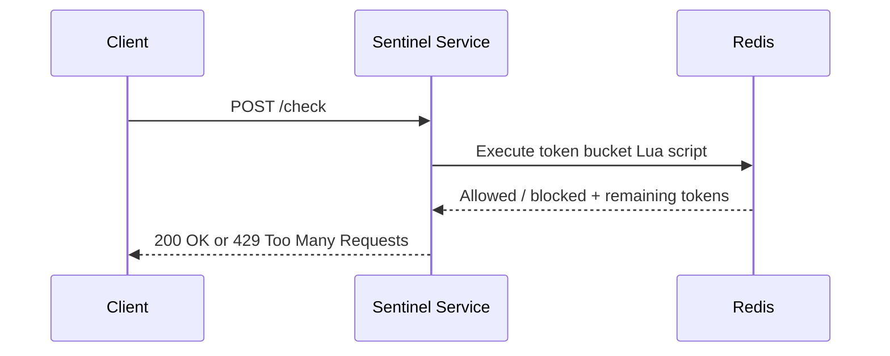
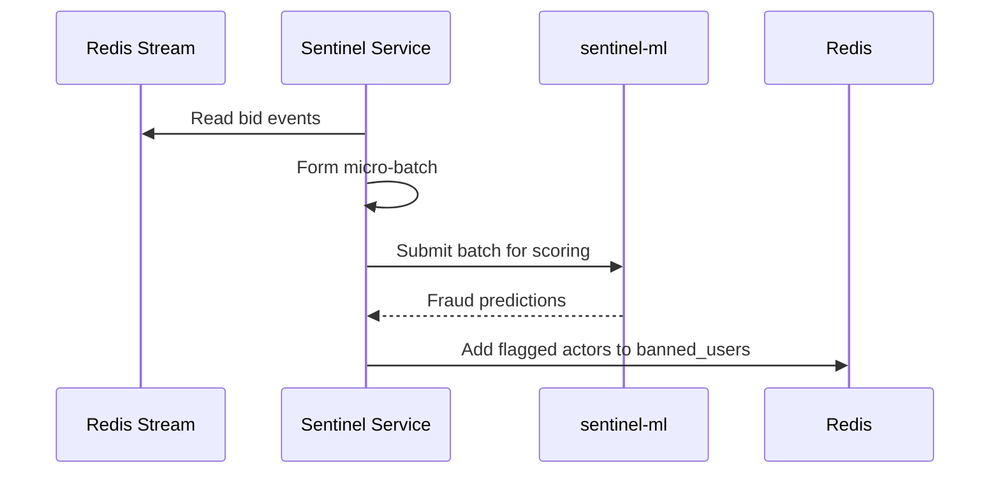

---
hide:
  - navigation
  - path
---

<style>
  .md-content__inner > h1:first-of-type {
    display: none;
  }
</style>

<div align="center">
  <p style="letter-spacing: 0.08em; text-transform: uppercase; color: #9ca3af; margin-bottom: 0.35rem;">
    Component
  </p>
  <h1 style="margin-top: 0;">Sentinel Service</h1>
  <p style="max-width: 760px; margin: 0 auto 1.25rem auto; color: #b6bdc8;">
    Responsible for rate-limit enforcement and asynchronous fraud screening.
  </p>
</div>

---

## Purpose

Sentinel serves two roles. On the synchronous path, it applies Redis-backed token bucket decisions before protected services absorb unnecessary traffic. Off the hot path, it consumes bid events from Redis Streams, batches them for model scoring, and records enforcement outcomes for the rest of the system.

## Responsibilities

- Enforce per-client request budgets through atomic token bucket decisions
- Share rate-limit state across multiple service instances
- Consume bid events from Redis Streams
- Forward micro-batches to the Python `sentinel-ml` service
- Write flagged actors to the `banned_users` Redis set

## Rate-Limit Decision Flow



The synchronous path is intentionally short. Sentinel receives a request, delegates the bucket update to Redis, and returns the decision without additional coordination.

## Fraud Analysis Flow



This pipeline stays off the request path. Bids are scored asynchronously, and enforcement data is written back to Redis without adding latency to bid execution.

## Token Bucket Model

Each caller is identified by `X-User-ID`. Redis stores the current token count and last refill time for that caller. On each request, Sentinel:

1. Computes elapsed time since the last refill
2. Adds newly earned tokens, capped at bucket capacity
3. Deducts the request cost when enough tokens are available
4. Returns a deny response when capacity is exhausted

All four steps run inside one Lua script so refill and consumption happen as a single atomic operation.

## Runtime Stack

| Layer | Technology |
| --- | --- |
| Language | Java 25 |
| Framework | Spring Boot 4 / WebFlux |
| State Store | Redis |
| Coordination | Lua scripts |
| Stream Processing | Redis Streams |
| ML Integration | Python FastAPI (`sentinel-ml`) |

## Quick Start

```yaml
services:
  sentinel-service:
    build: ./sentinel-service
    ports:
      - "8081:8081"
    environment:
      - SPRING_DATA_REDIS_HOST=redis
    depends_on:
      - redis

  redis:
    image: redis:7.2-alpine
    ports:
      - "6379:6379"
```

```bash
docker compose up -d
```

## Local Development

### Start Redis

```bash
docker run -d -p 6379:6379 --name sentinel-redis redis:7.2-alpine
```

### Run the service

```bash
./mvnw spring-boot:run
```

## API

### Endpoint

```text
POST /check
```

### Parameters

- `capacity` - maximum number of tokens in the bucket
- `rate` - refill rate in tokens per second
- `cost` - number of tokens consumed by the request
- `X-User-ID` header - unique identifier for the caller

### Example

```bash
curl -X POST "http://localhost:8081/check?capacity=10&rate=1&cost=1" \
  -H "X-User-ID: test_user"
```

### Response

```json
{
  "allowed": true
}
```

## API Documentation

When the service is running locally, the OpenAPI documentation is available at:

```text
http://localhost:8081/swagger-ui.html
```

---

<p><strong>Created by <a href="https://walker-systems.github.io/">Justin Walker</a></strong></p>
